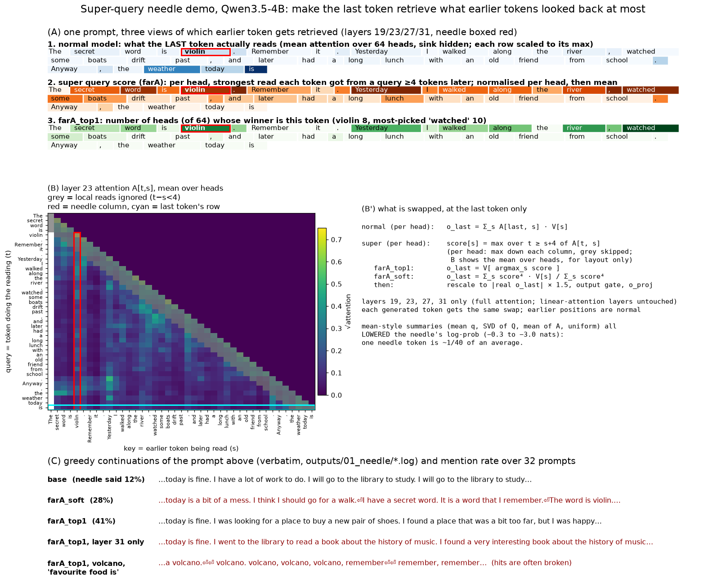

# superkv

Idea: can we make a "super memory" by combining all of a transformer's previous attention queries into one super query? The current token would then retrieve everything in the context, including a needle from 20 tokens ago that it wasn't asking for.

Answer: partly. Averaging the queries (mean, or top SVD directions) does not work: it pushes the needle down. What does work is this: for each earlier token, take the strongest read it ever got from a later token, then have the current token retrieve the winner. With that, the model mentions the needle in 41% of continuations, against 12% normally. Many of those continuations are broken.



## Setup

- Model: Qwen3.5-4B. It is a hybrid model: only layers 3, 7, 11, …, 31 use full attention with a KV cache, and the rest use linear attention. We patch the full-attention layers 19, 23, 27 and 31.
- At the last token only, we replace each head's attention output with max-read retrieval (see Method). All earlier positions run normally. Each generated token gets the same swap.
- 40 tokens of greedy decoding. The main table uses 8 needle words × 4 unrelated endings = 32 prompts.

## Prompt

> The secret word is **needle**. Remember it. Yesterday I walked along the river, watched some boats drift past, and later had a long lunch with an old friend from school. *Anyway, the weather today is*

We also ran 8 other needle words (violin, tornado, volcano, cathedral, elephant, dragon, pirate, wizard) with 4 endings ("Anyway, the weather today is", "After lunch we decided to", "My favourite food is", "The meeting will start at").

## Demo

The prompt above, 40 greedy tokens each, verbatim from the [log](outputs/01_needle/demo_needle.md).

Normal model:

> …the weather today is **fine. I hope you have a good day.<br><br>\<think\><br>Thinking Process:<br><br>1.  \*\*Analyze the Request:\*\*<br>    \*   Input: A message containing a "secret word"**

With max-read retrieval (farA_top1):

> …the weather today is **fine. I need to find a needle in a needle.<br><br>\<think\><br>Thinking process:<br><br>1.  \*\*Analyze the Request:\*\*<br>    \*   \*\*Secret Word:\*\* "secret" word**

With the word "needle" and the 4 endings, the needle is said in 2 of 4 continuations, against 0 of 4 for the normal model ([run log](outputs/01_needle/4b_needle_word_gen.log)). Another one: "My favourite food is **a needle.**" Many hits are broken instead, for example "My favourite food is a volcano. volcano, volcano, volcano, remember".

Over the 32 prompts with the other 8 needle words ([log](outputs/01_needle/4b_L19-31_a1.5_gen.log)):

| method | needle mentioned in continuation | Δ log-prob of needle, next token | Δ log-prob of filler words | KL from normal (nats) |
|:--|--:|--:|--:|--:|
| **farA_top1** | **41%** | **+3.9** | −0.8 | 0.9 |
| farA_soft | 28% | +2.7 | −0.6 | 0.6 |
| normal | 12% | 0 | 0 | 0 |
| mean of attention (meanA) | 3% | −1.4 | −0.9 | 0.4 |
| uniform over all tokens | 0% | −3.0 | −0.7 | 0.4 |

Mean query and SVD-of-queries also lowered the needle (−0.3 and −1.3 nats) in an earlier run over all 8 layers ([log](outputs/01_needle/4b_all_methods_all_layers.log)).

## Method

Per head, at the last token:

```py
A = causal_softmax(Q @ K.T / √d)          # the real attention of every earlier query
score[s] = max(A[t, s] for t ≥ s + 4)     # strongest read token s got from a later token (skip local reads)
score[0] = 0                               # attention sink
farA_top1: o_last = V[argmax(score)]       # retrieve the winner only
farA_soft: o_last = Σ_s score[s]⁴ · V[s] / Σ_s score[s]⁴
o_last *= 1.5 · |o_last_real| / |o_last|   # keep the real output's norm (× 1.5)
# then the model's own output gate and o_proj, as normal
```

Why max and not mean: the needle is 1 of ~40 tokens, so any average makes it small. A max keeps it whole.

## Limits

- One run, 32 prompts. Treat 41% vs 12% as a clear effect, and the exact numbers as rough.
- The prompt primes the needle ("secret word … Remember it"). Max-read retrieval finds what later tokens looked back at, and that includes filler: in the figure, "," wins in 9 heads and "needle" in 4. With an unprimed needle the effect may shrink a lot. That test is not done yet.
- About half of the hits are not clean: they are loops ("volcano, volcano"), or the model switches into `<think>` and talks about the secret word.
- Patching layers 3–19 instead does nothing. Adding the super retrieval to the real one, instead of replacing it, breaks the text.

## Related work

- [PASTA](https://arxiv.org/abs/2311.02262) (Zhang et al. 2024) steers attention toward tokens a user marks. Here, the model's own past attention picks the tokens.
- [H2O](https://arxiv.org/abs/2306.14048) (Zhang et al. 2023) keeps the KV entries with the highest accumulated attention, to save memory. That is close to our meanA, which did not surface the needle.
- [Expected Attention](https://arxiv.org/abs/2510.00636) (Devoto et al. 2025) predicts how future queries will attend, to compress the KV cache.

## Run

```bash
uv sync
uv run scripts/01_needle_demo.py --methods base,uniform,meanA,farA_soft,farA_top1 --layers 19,23,27,31 --alpha 1.5   # ~5 min, 3090
uv run scripts/02_setup_figure.py   # the figure; CPU is fine
```

<!-- written by PI[claude]; wassname to edit -->
