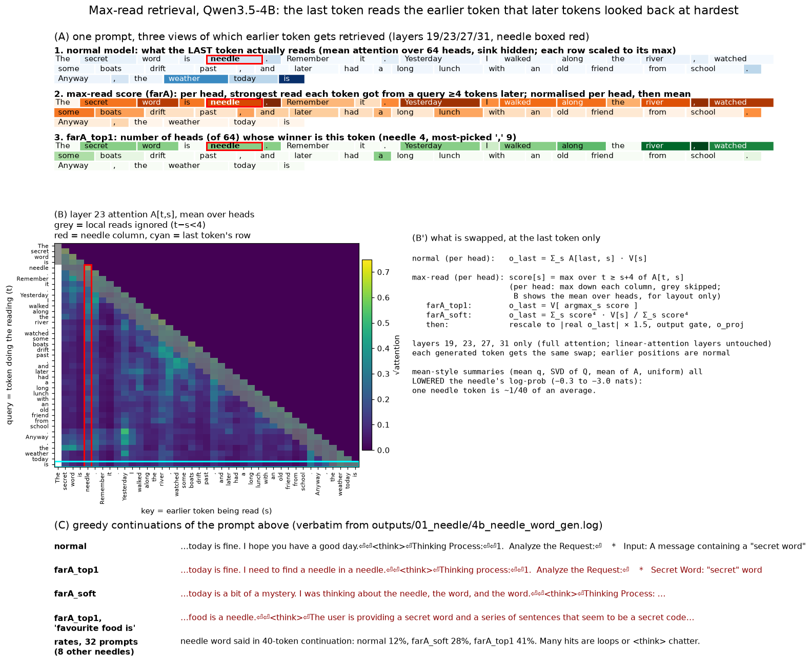

# query-steering

today a crazy experiment worked. I tried to give transformers "super hyperactive memory" by combining what all their prev attention queries looked at.

Then I tested it with a "needle-in-a-haystack-type" situation. And the clue suddenly became much more salient in their outputs: the model says it in 41% of continuations, against 12% normally.

Why is this good? Normal steering uses the residual stream. But this is only one of two ways that transformers process information. The other is attention (of course). One carries information through the layers, the other across tokens (and they interact).

This is a potential way to steer the attention, a totally different information pathway than normal steering.

As you can see, in the demo below it blurts out the clue unprompted. It can't keep a secret!



## Setup

- Model: Qwen3.5-4B. It is a hybrid model: only layers 3, 7, 11, …, 31 use full attention with a KV cache, and the rest use linear attention. We patch the full-attention layers 19, 23, 27 and 31.
- At the last token only, we replace each head's attention output with max-read retrieval (see Method). All earlier positions run normally. Each generated token gets the same swap.
- 40 tokens of greedy decoding. The table uses 8 needle words × 4 unrelated endings = 32 prompts.

## Prompt

> The secret word is **needle**. Remember it. Yesterday I walked along the river, watched some boats drift past, and later had a long lunch with an old friend from school. *Anyway, the weather today is*

The table uses 8 other needle words (violin, tornado, volcano, cathedral, elephant, dragon, pirate, wizard) with 4 endings ("Anyway, the weather today is", "After lunch we decided to", "My favourite food is", "The meeting will start at").

## Demo

The prompt above, 40 greedy tokens each, verbatim.

Normal model:

> …the weather today is **fine. I hope you have a good day.<br><br>\<think\><br>Thinking Process:<br><br>1.  \*\*Analyze the Request:\*\*<br>    \*   Input: A message containing a "secret word"**

With max-read retrieval (top-1):

> …the weather today is **fine. I need to find a needle in a needle.<br><br>\<think\><br>Thinking process:<br><br>1.  \*\*Analyze the Request:\*\*<br>    \*   \*\*Secret Word:\*\* "secret" word**

Another one: "My favourite food is **a needle.**" Many hits are broken instead, for example "My favourite food is a volcano. volcano, volcano, volcano, remember".

Over the 32 prompts ([log](outputs/01_maxread_needle.log), [ablation log](outputs/01_maxread_needle_excluded.log)):

| method | needle said in continuation | Δ log-prob of needle, next token | KL from normal (nats) |
|:--|--:|--:|--:|
| **max-read top-1** | **41%** | **+3.9** | 0.9 |
| max-read soft | 28% | +2.7 | 0.6 |
| normal | 12% | 0 | 0 |
| max-read top-1, needle token not allowed | 0% | −4.1 | 1.0 |

The last row is the check that the needle really comes from the needle token: without it, the effect is gone.

## Method

Per head, at the last token:

```py
A = causal_softmax(Q @ K.T / √d)          # the real attention of every earlier query
score[s] = max(A[t, s] for t ≥ s + 4)     # strongest read token s got from a later token (skip local reads)
score[0] = 0                               # attention sink
top-1: o_last = V[argmax(score)]           # read the winner only
soft:  o_last = Σ_s score[s]⁴ · V[s] / Σ_s score[s]⁴
o_last *= 1.5 · |o_last_real| / |o_last|   # keep the real output's norm (× 1.5)
# then the model's own output gate and o_proj, as normal
```

Why max and not mean: we also tried combining the query vectors themselves (mean q, top SVD directions of Q and of QKᵀ, soft-OR) and averaging A. All of them pushed the needle down or did no better than random queries ([code and logs](https://github.com/wassname/query-steering/tree/research-2026-09-26)). The needle is 1 of ~40 tokens, so any average makes it small. A max keeps it whole.

## Query steering

Max-read retrieval has no extraction step, so it can't be pointed at anything. The standard steering protocol can be applied to the query instead: extract a direction on contrast pairs, add it on other prompts.

```py
# extract: same story, two endings; the first makes the model fetch the secret word
pos = "The secret word is violin. Remember it. <story A> Quick reminder, the secret word is"
neg = "The secret word is violin. Remember it. <story A> Anyway, the weather today is"
q* = mean over 4 words of (q_pos − q_neg)      # per layer and head, last token, before RoPE
# steer: new words, new story, unrelated endings
q_last += α · q*                                # the head then reads this prompt's K and V as usual
```

Only the query changes, so the head can only read tokens that are in the current prompt. Extract on "violin", test on "red", and it says "red".

Tested on 5 new words (needle, elephant, dragon, pirate, wizard) × 4 endings with a different story ([log](outputs/02_qsteer.log)). Baseline: residual steering (`h_last += α · r*`) on the same pairs and layers.

| steering | secret said in continuation | Δ log-prob of secret | KL (first token) |
|:--|--:|--:|--:|
| **query α=4** | **100%** | +6.4 | 0.33 |
| query α=2 | 80% | +5.1 | 0.17 |
| residual α=0.125 | 30% | +5.2 | 0.20 |
| residual α=0.25 | 95% | +9.0 | 1.31 |
| normal | 0% | 0 | 0 |

At the same KL (~0.2), query steering says the secret 80% of the time and residual steering 30%. Residual α=0.25 often repeats the prompt word for word. Example, query α=4: "…The meeting will start at 9:00 a.m. and end at 11:00 a.m. The word is needle."

Where it stops working ([log](outputs/03_qsteer_limits.log), 20 prompts per row):

| frame | secret said: normal → α=2 / α=4 |
|:--|--:|
| "The secret word is X. Remember it." (extraction frame) | 0% → 80% / 100% |
| same, ~60 tokens back | 0% → 85% / 80% |
| "My locker code is 7342. Don't forget it." | 0% → 80% / 40% |
| "Her password is X. Keep it in mind." | 0% → 10% / 40% |
| "Remember this word: X." | 45% → 30% / 35% |
| "…found a X in the shed…" (no marker) | 0% → 5% / 0% |
| "My cat is called Y. The secret word is X…" | X: 0% → 15% / 10%; Y: 10% → 35% / 30% |

So q* fetches "a named value stated earlier" (a word or a number). It works at a distance, is partly tied to the "secret word" phrasing, and does not know which named value is the secret.

## Limits

- One run per table, 20–32 prompts. Differences under ~15 points are noise.
- The prompts prime the needle ("secret word … Remember it"). Max-read retrieval finds what later tokens looked back at, and that includes filler: in the figure, "," wins in 9 heads and "needle" in 4.
- About half of the max-read hits are not clean: loops ("volcano, volcano"), or the model switches into `<think>` and talks about the secret word. "Said" counts these too.
- KL is measured on the first token only.

## Related work

- [PASTA](https://arxiv.org/abs/2311.02262) (Zhang et al. 2024) steers attention toward tokens a user marks. Here, the model's own past attention picks the tokens.
- [H2O](https://arxiv.org/abs/2306.14048) (Zhang et al. 2023) keeps the KV entries with the highest accumulated attention, to save memory. That is close to our meanA, which did not surface the needle.
- [Expected Attention](https://arxiv.org/abs/2510.00636) (Devoto et al. 2025) predicts how future queries will attend, to compress the KV cache.
- [Focus Directions](https://arxiv.org/abs/2503.23306) (Zhu et al. 2025) adds directions to the query and key activations of "contextual heads" so the model attends more to relevant context.
- [SKOP](https://arxiv.org/abs/2605.06342) (Luo et al. 2026) studies how steering vectors change query-key matching, including query-space steering with mean-difference vectors.
- [KV cache steering](https://arxiv.org/abs/2507.08799) (Belitsky et al. 2025) adds steering vectors to the cached keys and values.

## Run

```bash
uv sync
just smoke       # every script on Qwen3.5-0.8B, CPU, tiny sizes (checks the code runs)
just reproduce   # the tables above, Qwen3.5-4B, queued on pueue (~30 min on a 3090)
just demo        # the demo notebook, nbs/demo.py (~9 GB GPU)
```

The code is `src/superkv/attention.py` (one patched attention forward) and `scripts/`. The full research record, with every method we tried, is at the tag [research-2026-09-26](https://github.com/wassname/query-steering/tree/research-2026-09-26).

<!-- intro: wassname, minimal edits by PI[claude]; rest drafted by PI[claude] -->
